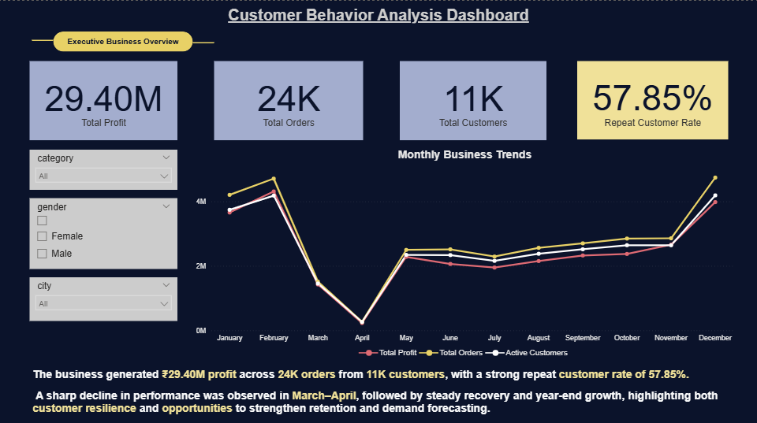

*# Customer Behavior Analysis Dashboard

## Project Overview
This project analyzes retail business data to uncover insights into customer behavior, product performance, and overall business trends. The goal was to transform fragmented raw data into actionable insights through an end-to-end analytics workflow.

## Business Problem
The business lacked a unified view of customer behavior, profitability, and product performance due to scattered and unstructured data. This delayed decision-making and limited visibility into customer retention and key profit drivers.

## Solution
Built an end-to-end analytics pipeline to clean, integrate, and visualize data for better business decision-making.

## Tools & Technologies
- Python (data cleaning and preprocessing)
- SQL (data integration and table joining)
- AWS S3 (cloud storage)
- Power BI (interactive dashboard development)

## Project Workflow
1. Cleaned raw datasets using Python notebooks.
2. Integrated multiple datasets into a unified analytical dataset.
3. Stored and managed data using AWS S3.
4. Built interactive Power BI dashboards to analyze:
   - Business Performance Overview
   - Customer Behavior & Retention Insights
   - Product & Market Performance

## Key Insights
- Generated **₹29.40M** profit across **24K orders** from **11K customers**
- Achieved **57.85% repeat customer rate**, indicating strong customer retention
- Identified top-performing products and profit-driving categories
- Detected seasonal demand shifts across product categories
- Highlighted high-performing store regions for business growth

Dashboard Screenshots
### Business Performance Overview

### Customer Behavior & Retention Insights

### Product & Market Performance

## Repository Contents
- Python notebooks for data cleaning
- Final cleaned dataset
- Power BI dashboard (.pbix)
- Dashboard screenshots**
